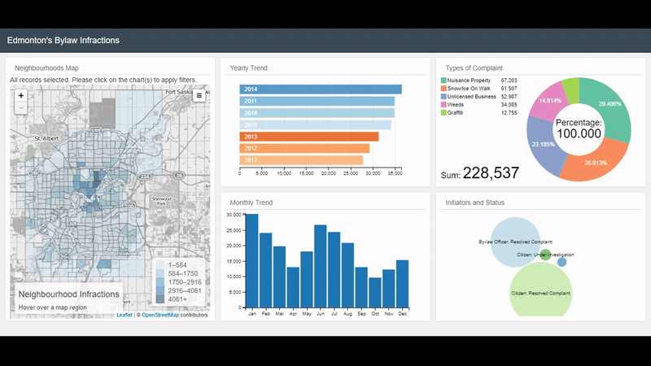

# Edmonton Bylaw Infractions II

## Dashboard Summary
Larger map display, row and bar chart addition, and map encapsulating selection options are some improvements to [Dashboard I](https://github.com/Edmonton-Open-Data/Edmonton-Bylaw-Infractions-I). Data used in Dashboard II is similar to Dashboard I. Dashboard II's code is more efficient, maintainable, and scalable. 

Inspiration for the Project: [Mean Daily Temperature Extremes](http://bl.ocks.org/KatiRG/cccd23dd7a830da0de5c) and drive to complete crucial [To-do's](https://github.com/Edmonton-Open-Data/Edmonton-Bylaw-Infractions-I#to-dos) 
Frameworks used include: [Leaflet.SlideMenu](https://github.com/unbam/Leaflet.SlideMenu), [FontAwesome](https://fontawesome.com/), and [same frameworks as Dashboard I](https://github.com/Edmonton-Open-Data/Edmonton-Bylaw-Infractions-I#dashboard-summary) 
Best viewed in: Google Chrome 
Desktop and mobile Dashboard: [****BYLAW INFRACTIONS DASHBOARD II (CLICK ME!)****](https://edmonton-open-data.github.io/Edmonton-Bylaw-Infractions-II/index.html) 

***Note: FAILURES OF DASHBOARD I MADE DASHBOARD II  A REALITY***  
## Lessons Learned from Dashboard I & II
|  No.   | Dashboard I        | Dashboard II           |
| ------ | ------------- | ------------- |
|    1   | Wrote code in the constraints of [Le choropleth](http://intellipharm.github.io/dc-addons/examples/leaflet-marker.html) and [Interactive Data Visualization](http://adilmoujahid.com/posts/2016/08/interactive-data-visualization-geospatial-d3-dc-leaflet-python/)     | Learning [responsive basics](https://www.packtpub.com/web-development/building-responsive-data-visualizations-d3js-video) facilitated desired [improvements](https://github.com/Edmonton-Open-Data/Edmonton-Bylaw-Infractions-I#to-dos) |
|    2   | Not taking time to understand arising issues      | Understood arising issues using global variables and Document Object Model      |
|    3   | Intimidated by [Mean Daily Temperature Extremes](http://bl.ocks.org/KatiRG/cccd23dd7a830da0de5c) code and didn't extract needed code | Diving deeper into [d3.js](http://devdocs.io/d3~3/), [dc.js](http://dc-js.github.io/dc.js/docs/html/), [leaflet.js](http://leafletjs.com/reference-0.7.7.html), [dc-addons.js](https://github.com/Intellipharm/dc-addons#dc-addons), and [bootstrap](https://getbootstrap.com/docs/4.0/getting-started/introduction/) docs aided in code efficiency      | 
|    4   | Abruptly used researched examples without deep thought | Mathematical procedures and operations are paramount for responsiveness      | 
## Improvements
* Altered layout to enable smooth viewing on both mobile and desktop
* Made the dashboard responsive using [viewbox sizing](http://dc-js.github.io/dc.js/docs/html/dc.baseMixin.html#useViewBoxResizing__anchor)
* Changed the default map base layer at [base-map-chart.js](https://github.com/Edmonton-Open-Data/Edmonton-Bylaw-Infractions-II/blob/master/libs/dc_addons/base-map-chart.js)
* Removed [heatmap](https://github.com/Edmonton-Open-Data/Edmonton-Bylaw-Infractions-I#3-heatmap-yearly-and-monthly-trend) to speed up yearly and monthly analysis
* [Checked To-do's](https://github.com/Edmonton-Open-Data/Edmonton-Bylaw-Infractions-I#to-dos) for Dashboard I
## To-do's
- [ ] Update the text based on window resizing 
- [ ] Add responsive [map zooming](https://github.com/mikelotis/Edmonton-Municipality-II) and enhance chart title texts
- [ ] Refactor the code using functional programming eg. using [transducers](https://medium.freecodecamp.org/efficient-data-transformations-using-transducers-c779043ba655)
- [ ] Improve clicked neighbourhoods' fill and stroke [colors](https://medium.freecodecamp.org/an-intro-to-color-theory-how-to-combine-colors-and-set-the-mood-of-your-designs-79bf5a45b3d)
- [ ] Add capability to filter data by clicking the legend ranges, potential solutions - [filtering map markers](https://blogs.kent.ac.uk/websolutions/2015/01/29/filtering-map-markers-with-leaflet-js-a-brief-technical-overview/), [filter leaflet maps with a slider](http://www.digital-geography.com/filter-leaflet-maps-slider/), and [filtering data in leaflet](https://www.youtube.com/watch?v=rbnlnXIT4eI)
- [ ] Add sidebar to house additional features, helpers - [How To - Side Navigation](https://www.w3schools.com/howto/howto_js_sidenav.asp) and [How to think like a programmer](https://www.w3schools.com/howto/howto_js_sidenav.asp)
- [ ] [Paginate](https://github.com/Intellipharm/dc-addons#pagination-mixin) the row chart
- [ ] Update the [data](https://data.edmonton.ca/Community-Services/Bylaw-Infractions/xgwu-c37w)
- [ ] Improve user interaction experience for mobile
- [ ] [Unchecked To-do's](https://github.com/Edmonton-Open-Data/Edmonton-Bylaw-Infractions-I#to-dos) from Dashboard I

<!--
Improvement of the previous [version](https://github.com/mikelotis/Edmonton-Bylaw-Infractions-I) and detailed information **coming soon!**
[****Updated dashboard (CLICK ME FOR DASHBOARD)****](https://edmonton-open-data.github.io/Edmonton-Bylaw-Infractions-II/index.html)
-->
